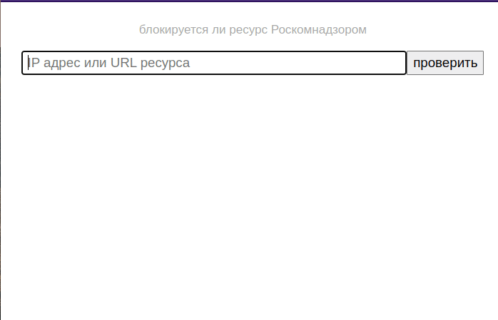

# Check if the internet resource is blocked by RKN

Single-file executable binary with embedded web-interface

- check by IP (resolve by hostname via external DNS)
- check by hostname (domains in the database)
- check by url (http urls in the database)

## Config - ENV variables
|                |                |
|----------------|----------------|
| RKNW_PORT      | service port   |
| RKNW_DB_HOST   | db server host |
| RKNW_DB_NAME   | db name        |
| RKNW_DB_USER   | db username    |
| RKNW_DB_PASSWD | db password    |

## Build
Prepare embedded html template
```bash
bash ./prepare_template.sh
```

Build the binary
```bash
CGO_ENABLED=0 GOOS=linux GOARCH=amd64 go build -ldflags '-w -s -extldflags "-static"' -o rknw ./src
```

## Screecast

